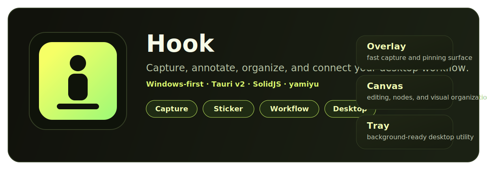
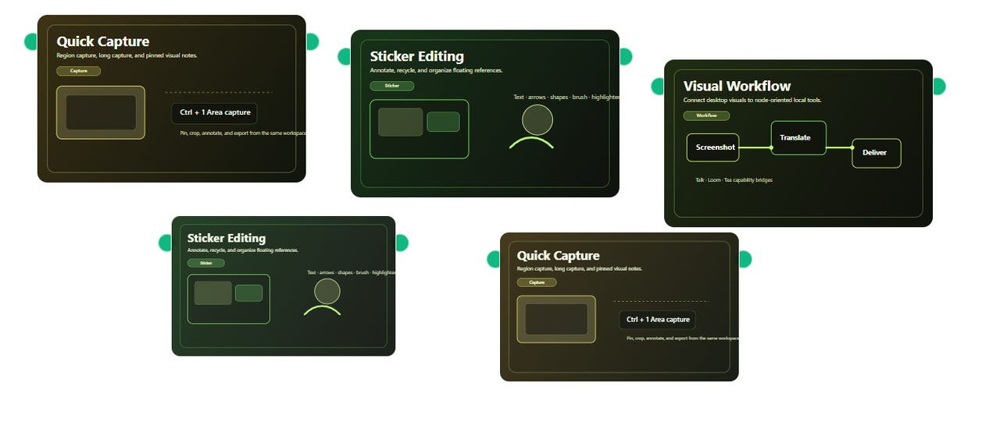
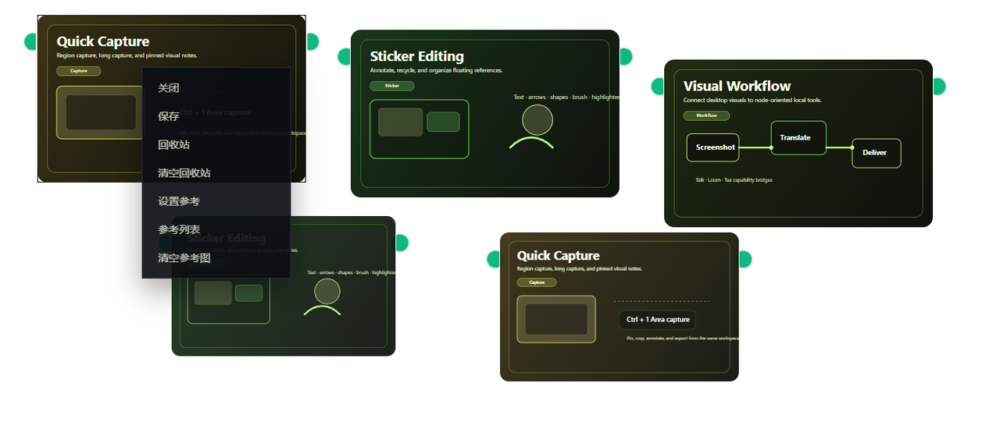

# Hook

<p align="center">
  
</p>

<p align="center">
  <a href="README.md"><strong>English</strong></a>
  ·
  <a href="README.zh-CN.md"><strong>简体中文</strong></a>
</p>

<p align="center">
  Open-source Windows-first desktop capture, sticker editing, and visual workflow workspace.
</p>

<p align="center">
  Maintained by <strong>yamiyu</strong>.
</p>

<p align="center">
  <a href="https://github.com/aiaimimi0920/Hook/actions/workflows/build-hook-exe.yml"></a>
  
  
  
  <a href="LICENSE"></a>
</p>

Hook is built for people who want more than a simple screenshot button. It combines:

- fast region capture and long capture,
- sticker-based visual organization and annotation,
- a desktop canvas for node-style workflow interactions,
- local capability bridges for Talk / Loom / Tea style integrations.

It is a good fit for lightweight screenshot workbenches, visual planning boards, desktop AI frontends, and workflow-oriented capture tools.

## Preview

<p align="center">
  
</p>

<p align="center">
  
  
</p>

## Contents

- [Preview](#preview)
- [Why Hook](#why-hook)
- [Highlights](#highlights)
- [Desktop modes](#desktop-modes)
- [Download and try](#download-and-try)
- [Quick start](#quick-start)
- [Build a local EXE](#build-a-local-exe)
- [Documentation](#documentation)
- [Open-source identity and compatibility](#open-source-identity-and-compatibility)
- [Development](#development)
- [Contributing](#contributing)
- [License](#license)

## Why Hook

Hook focuses on the gap between a screenshot utility and a heavier design tool:

- capture first, then keep working on top of the captured material,
- pin images and notes into a reusable desktop workspace,
- organize references and recycled assets without leaving the app,
- connect desktop visuals to local workflow nodes and capability bridges.

## Highlights

- **Capture and long capture**
  - region capture
  - vertical/horizontal long capture session flow
  - file-backed capture payloads for desktop performance
- **Sticker and annotation workspace**
  - crop, borders, opacity, raster effects, color copy
  - text, numbering, shapes, brush, highlighter
  - recycle bin and reference library
- **Desktop workflow canvas**
  - node graph, links, grouped parameters, sync hooks
  - editing-oriented top strip and context menus
  - local desktop launch helpers and single-instance handling
- **Local integrations**
  - Talk voice capture bridge
  - Loom planning / capability bridge
  - Tea intake bridge

## Desktop modes

| Mode | Role |
| --- | --- |
| Overlay | Transparent always-on-top capture and pinning surface |
| Canvas | Focused editing and workflow workspace |
| Tray | Background-resident mode with tray re-entry |

## Download and try

### Option A: GitHub Actions artifact

The repository builds a Windows EXE automatically through GitHub Actions:

- Workflow: <https://github.com/aiaimimi0920/Hook/actions/workflows/build-hook-exe.yml>
- Artifact name: `hook-windows-x64`

This is currently the most direct way to try the latest repository build.

### Option B: Releases

If versioned releases are published later, check:

- <https://github.com/aiaimimi0920/Hook/releases>

### Current package shape

The current public package target is the **minimal EXE payload only**.

## Quick start

Recommended local environment:

- Windows
- Node.js 20+
- npm
- Rust stable toolchain

Install dependencies:

```bash
npm install
```

Run the desktop development shell:

```bash
npm run dev:tauri
```

Useful notes:

- `npm run dev:tauri` is the main desktop development entrypoint.
- `npm run dev` is suitable for frontend-only work.
- `npm run build && npm run serve:static` is suitable for static browser preview.

## Build a local EXE

Recommended local build command:

```powershell
powershell -NoProfile -ExecutionPolicy Bypass -File .\scripts\build-local-hook-exe.ps1 -Force
```

Default output:

```text
..\release\Hook\hook.exe
```

Compatibility wrappers are still kept:

- `build-hook-release.bat`
- `package-hook-release.ps1`

They delegate to the Hook-local build flow.

## Documentation

### Current docs

Read these first for the live codebase:

- `README.md`
- `README.zh-CN.md`
- `PROJECT_OVERVIEW.md`
- `TECHNICAL_ARCHITECTURE.md`

### Archived docs

Historical migration, plan, and spec records live under:

- `docs/migration/*`
- `docs/superpowers/plans/*`
- `docs/superpowers/specs/*`

If archived docs conflict with current code, prefer the root docs above.

## Open-source identity and compatibility

- The public Tauri bundle identifier uses the yamiyu namespace: `com.yamiyu.hook`.
- Hook keeps the visible runtime naming as `Hook` / `hook.exe`.
- Local clipboard cache remains under `LOCALAPPDATA/Hook/...`.
- Session, history, and tool settings include legacy fallbacks for older installs that previously wrote under:
  - `io.github.aiaimimi0920.hook`
  - `com.vmjcv.hook`
- The public repository URL remains the live GitHub location:
  - <https://github.com/aiaimimi0920/Hook>

## Development

Useful verification commands:

```bash
npm run typecheck
npm run test
npm run verify:local
```

`npm run verify:local` is the main local verification gate. It runs:

1. `npm run typecheck`
2. `npm run test`
3. `npm run build`
4. `build-hook-release.bat`

## Contributing

Issues, build feedback, and focused improvement proposals are welcome:

- Issues: <https://github.com/aiaimimi0920/Hook/issues>
- Actions: <https://github.com/aiaimimi0920/Hook/actions>

When contributing, prefer current root docs over archived historical planning material.

## License

MIT
